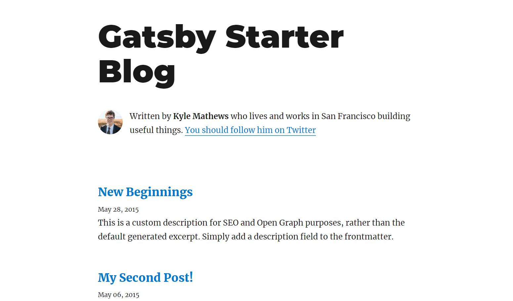
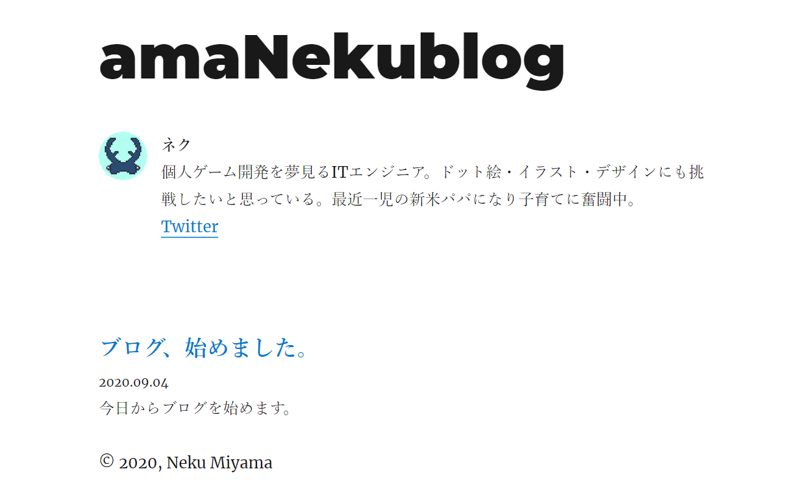
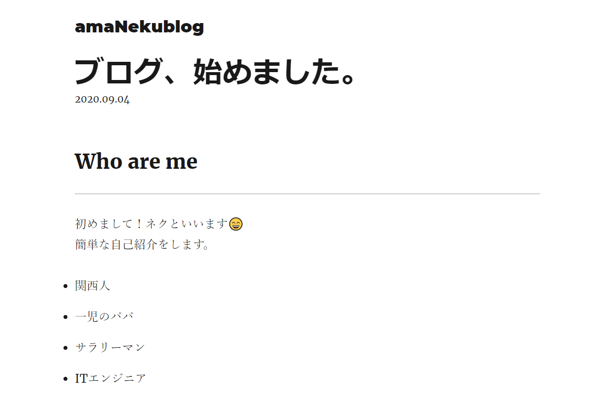

今回は、GatsbyJSでブログを始めようと決めてから、デプロイするまでに行ったことを解説します。GatsbyJSのインストールとgatsby-starter-blogを使ったGatsbyJSプロジェクトの作成までは済んでいる前提です。変更内容は、ブログの内容やプロフィールが主になります。

### 1.現状の理解

---

### 1-1.イメージ

gatsby-starter-blogそのままだと、こんな状態です。これから自分用の内容に置き換えていきます。



※デモサイトは[こちら](https://gatsby-starter-blog-demo.netlify.app/)

### 1-2.フォルダ構成を知る

変更するにはまず、どこに何があるのかを知る必要があります。  
※❔が付いている部分はまだ詳しく理解できていないです><

```Text
root
|-- /content          #記事用
    |-- /assets         #記事共通で使う素材
    |-- /blog           #記事本体。記事個別で使う素材もここ
|-- /node_modules     #使用nodeモジュール
|-- /public           #ビルドでできる。公開用
|-- /src              #ソースコード
    |-- /components     #任意。ページ共通で使うコンポーネント。
    |-- /pages          #必須。ここにあるファイルが自動的にページになる。フォルダ名がそのページへのパスになる。
    |-- /templates      #❔ブログポストのテンプレを配置。GraphqlでContentsから動的に記事を作成(注入？)できる。
    |-- /utils          #ユーティリティ
|-- /static           #処理せずそのまま配置したいファイル類。favicon.icoとか
|-- gatsby-config.js  #設定のメインファイル。サイトのメタデータや使用するプラグイン
|-- gatsby-node.js    #❔nodeAPI（記事を生成する側のファイル）に対して影響を与える設定類
|-- gatsby-ssr.js     #❔ServerSideRenderingAPIに対して影響を与える設定類
|-- gatsby-browser.js #❔browserAPI（ブラウザで表示する側のファイル）に対して影響を与える設定類
```

詳細：

```Text
content                 #記事用
|-- /assets               #記事共通で使う素材
    |-- gatby-icon.png      #サイトのfavicon用
    |-- profile-pic.png     #プロフィール画像
|-- /blog                 #記事本体。記事個別で使う素材もここ
    |-- /hello-wolrd
        |-- index.md
        |-- salty_egg.jpg
    |-- ...
```

```Text
src                      #ソースコード
|-- /components            #ページ共通で使うコンポーネント。
    |-- bio.js               #biography=自己紹介。
    |-- layout.js            #❔サイト全体のレイアウト。header、main、footer。
    |-- seo.js               #❔SEOに必要なもの（そもそもSEOをよくわかってない）
|-- /pages                 #必須。ここにあるファイルが自動的にページになる。フォルダ名がそのページへのパスになる。
    |-- 404.js               #404のページ
    |-- index.js             #ホームページ
    |-- using-typescript.tsx #❔typescriptを使うために必要なファイルらしい。使わないなら消していいらしい
|-- /templates             #ブログポストのテンプレを配置。GraphqlでContentsから動的に記事を作成(注入？)できる。
    |-- blog-post.js         #記事ページのベースとなるページ（多分）
|-- /utils                 #ユーティリティ
    |-- typography.js        #❔typographyで使う設定
```

```Text
statics
|-- favicon.ico   #ブラウザのタブ部分に出てくる画像
|-- robots.txt    #❔robots.txt（って何やろ...？）
```

参考：  
[Gatsby Project Structure](https://www.gatsbyjs.com/docs/gatsby-project-structure/)  
[Gatsby のファイル構成 | suzukalight.com](https://suzukalight.com/2019-07-01-file-structure/)

## 2.変更箇所を列挙する

---

- サイトのメタデータ（作成者名とか）
- プロフィール画像
- favicon
- 記事
- 日付をYYYY.MM.DD形式に
- コピーライト
- プロフィールの細かいところ

これだけ！

## 3.必要な変更箇所を変更する

---

### 3-1.サイトのメタデータ（作成者名とか）

/gatsby-config.jsを変更します。

```jsx
module.exports = {
  siteMetadata: {
    title: `amaNekublog`,
    author: {
      name: `ネク`,
      summary: `個人ゲーム開発を夢見るITエンジニア。ドット絵・イラスト・デザインにも挑戦したいと思っている。`,
    },
    description: `ゲーム・プログラミング・ドット絵・イラスト・デザインを中心にお役立ち情報から個人的な考えまで”あまねく”発信します。`,
    siteUrl: `https://nekumiyama.com/`,
    social: {
      twitter: `nekumiyama`,
    },
  },
```

### 3-2.プロフィール画像

- /contents/assets内のprofile-pic.jpgを変更します。
- ※ファイル名を変えたい場合は/src/components/bio.jsの以下を変更しましょう。

```jsx
avatar: file(absolutePath: { regex: "/avater.png/" }) {
```

### 3-3.favicon

- 今回はプロフィール画像を再利用します。
- /gatsby-config.jsを編集します。

```jsx
{
  resolve: `gatsby-plugin-manifest`,
  options: {
    name: `amaNekublog | ネクのブログ`,  //☆ついでに変更
    short_name: `amaNekublog`,          //☆ついでに変更
    start_url: `/`,
    background_color: `#ffffff`,
    theme_color: `#663399`,
    display: `minimal-ui`,
    icon: `content/assets/avater.png`,   //★ここ
  },
},
```

※/static内のfavicon.icoは変更しなくてよい（引っ掛かるところだった😅）

### 3-4.記事

- /blog内の/hello-worldフォルダ以外を削除します。
- /hello-worldをリネームします。⇒先頭に公開日をつけて日付順に並ばせる狙い
- /hello-worldの記事内容を更新します。

### 3-5.日付をYYYY.MM.DD形式に

- /src/pages/index.jsを変更します。

```jsx
export const pageQuery = graphql`
  query {
    site {
      siteMetadata {
        title
      }
    }
    allMarkdownRemark(sort: { fields: [frontmatter___date], order: DESC }) {
      edges {
        node {
          excerpt
          fields {
            slug
          }
          frontmatter {
            date(formatString: "YYYY.MM.DD")  //★ここ
            title
            description
          }
        }
      }
    }
  }
`
```

- /src/templates/blog-post.jsを変更します。

```jsx
export const pageQuery = graphql`
  query BlogPostBySlug($slug: String!) {
    site {
      siteMetadata {
        title
      }
    }
    markdownRemark(fields: { slug: { eq: $slug } }) {
      id
      excerpt(pruneLength: 160)
      html
      frontmatter {
        title
        date(formatString: "YYYY.MM.DD")  //★ここ
        description
      }
    }
  }
`
```

### 3-6.コピーライト

/src/components/layout.jsを変更します。

```jsx
<footer>
    © {new Date().getFullYear()}, Neku Miyama
</footer>
```

参考：（そもそもコピーライトの書き方がわからなかったため参考にしました）  
[【保存版】もう迷わない！フッターに表記するコピーライトの正しい書き方とタグ【HTML5・PHP・JavaScript】](https://deco8.net/web/footer-copyright-html-tag/)

### 3-7.プロフィールの細かいところ

- 「Written by ネク」→単純に「ネク」にして、改行したい
- 「You should follow him on Twitter」→改行して「Twitter」にしたい

/src/components/bio.jsを変更します。

```jsx
<p>
  <strong>{author.name}</strong>
  <p>{author.summary}</p>
  <p>
    <a href={`https://twitter.com/${social.twitter}`}>Twitter</a>
  </p>
</p>
```

### 3-8.完成！

和文のせいか見た目がよくないですが、、、ブログ内容は自分のものになりました！





## 4.デプロイする

---

以下のGatsbyJSの公式ページにGitHub Pagesへのデプロイ方法が説明されているので、これを参考にGitHub Pagesにデプロイしてみます。（なんと無料！🤑）

[How Gatsby Works with GitHub Pages](https://www.gatsbyjs.com/docs/how-gatsby-works-with-github-pages/)

### 手順

1. ローカルで`git commit`しておく
2. GitHubにリポジトリを作成
3. `git merge --allow-unrelated-histories origin/master` をして強制的に？マージ
4. `git push -u origin master` でGitHubにpush
5. 参考サイトの手順でデプロイ用の設定を実施
6. `npm run deploy` すればデプロイ完了🚀

※`npm run deploy`  で「fatal: A branch named 'gh-pages' already exists.」と出たら、node_modules/.cache/gh-pagesを削除する。

以上です！　次回はブログの「テキスト装飾」を変える方法を解説します！
