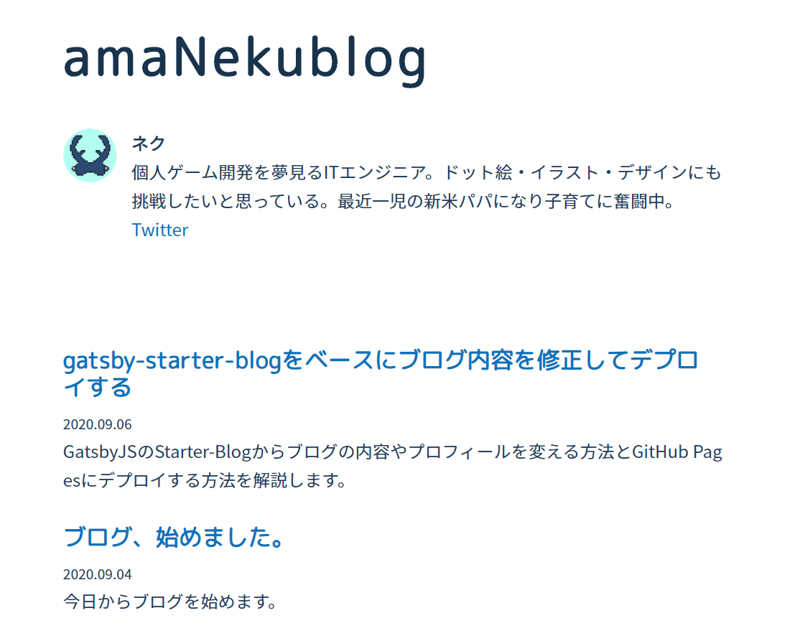

前回はgatsby-starter-blogを使ってブログを作り、GitHub Pagesにデプロイしました。しかし、初期状態だと文字バランスが悪く、あまり私の好みじゃなかったです。そこで今回は、gatsby-starter-blogのベースからテキストの装飾をアレンジする方法を紹介します。

ほんのちょっと見た目を変えるだけで見違えるので、よりオリジナル感を出したい方にお勧めです。

## 1. プラグインを学ぶ

---

Gatsbyはプラグインを使うことで様々な便利機能を追加することができます。

＜参考＞  
[Plugins](https://www.gatsbyjs.com/docs/plugins/)

プラグインの利用手順はとても単純で、以下の2ステップで済みます。

1. `npm install --save (プラグイン名)` でプラグインをインストールする
2. /gatsby-config.js の `plugins` 配列に1.でインストールしたプラグインを追加する

## 2. Typography.js について

---

gatsby-starter-blog には最初から [gatsby-plugin-typography](https://www.gatsbyjs.com/plugins/gatsby-plugin-typography/?=typo) というプラグインがインストールされています。これは [Typography.js](https://github.com/KyleAMathews/typography.js) を利用するためのプラグインです。

Typography.js はWebサイトのタイポグラフィを簡単に美しくするためのライブラリです。タイポグラフィというのは文字のデザインに関するあれこれのことです。文字フォント、文字の大きさ・色、行間といったことをひっくるめたものです。

今回は Typography.js を利用して、ブログの文字デザインを変えていきます。

## 3. 現状の確認

---

タイポグラフィに関する構成は、gatsby-plugin-typography の追加と一緒に設定するオプション `pathToConfigModule` に指定されているファイルで行います。初期状態では`src/utils/typography` となっています。

```jsx
module.exports = {
  ...
  plugins: [
  ...
    {
      resolve: `gatsby-plugin-typography`,
      options: {
        pathToConfigModule: `src/utils/typography`,  //★
      },
    },
  ],
}
```

現状の `src/utils/typography.js` はこうなってます。

```jsx
import Typography from "typography"
import Wordpress2016 from "typography-theme-wordpress-2016"

Wordpress2016.overrideThemeStyles = () => {
  return {
    "a.gatsby-resp-image-link": {
      boxShadow: `none`,
    },
  }
}

delete Wordpress2016.googleFonts

const typography = new Typography(Wordpress2016)

// Hot reload typography in development.
if (process.env.NODE_ENV !== `production`) {
  typography.injectStyles()
}

export default typography
export const rhythm = typography.rhythm
export const scale = typography.scale
```

Typography.js ではテーマというものがあり、ここでは `typography-theme-wordpress-2016` というテーマを使っているようです。

テーマの基本的な利用方法は次の通りです。

1. テーマをインストールする
2. typography.js を以下のように作成する

```jsx
import Typography from "typography"
import grandViewTheme from "typography-theme-grand-view"

const typography = new Typography(grandViewTheme)

// Export helper functions
export const { scale, rhythm, options } = typography
export default typography
```

また、テーマをベースにしてアレンジ（一部の構成を変更）することも可能です。

※より詳しく知りたい方は [gatsby-plugin-typography のプラグイン解説サイト](https://www.gatsbyjs.com/plugins/gatsby-plugin-typography/?=typo) か [Typography.jsのGitHubリポジトリのReadme](https://github.com/KyleAMathews/typography.js) を参照。

今回はテーマは使わず、すべての構成項目を自分好みの構成に変更していきます。

## 4. 要望と実装

---

### 4-1. 構成可能な項目

Typography.js公式のGiHubページに記載されていますが、次のQiitaの記事にて日本語でまとめてありましたので、引用します。

[Typography.jsによるフォントスタイルの設定まとめ - Qiita](https://qiita.com/MikihiroSaito/items/1ab9d5eeea66a163648b)

|項目|内容|
|----|----|
|title|テーマのタイトル|
|baseFontSize|ピクセルによる基本のフォントサイズ。デフォルトは 16px|
|baseLineHeight|基本の line height の大きさ。単位なしの数値で定義。 デフォルトは 1.45|
|scaleRatio|文字の大きさの割合。baseFontSize との相対的な文字の大きさを定義。例えば scaleRatio が 2、baseFontSize が 16px であれば h1 は 32px となる。|
|googleFonts|Google Font の設定を配列で設定できる|
|headerFontFamily|header のフォントに対しての['Helvetica', 'sans-serif']のようなフォントファミリースタックの配列を設定。 デフォルトは system UI のフォントスタックが適用される|
|bodyFontFamily|body に対するフォントに対して font family のスタックの配列を設定。 デフォルトは['georgia', 'serif']|
|headerColor|header の基本フォントカラーを指定。デフォルトは上位からの継承|
|bodyColor|body の基本フォントカラーを指定。 デフォルトは hsl(0,0%,0%,0.8)|
|headerWeight|header の基本フォントウエイトを指定。デフォルトは bold|
|bodyWeight|body の基本フォントウエイトを指定。 デフォルは normal|
|boldWeight|bold の大きさを定義。デフォルトは bold|
|blockMarginBottom|ブロック要素に対する基本 margin bottom の指定。デフォルトは line-height の高さ（1 "rhythm unit"）がそのままそのブロック要素の高さになる|
|includeNormalize|normalize.css を読み込ませるかどうかの指定。デフォルトは true で normalize.css を読み込む。読み込まない場合は false にする|
|overrideStyles|自動的に追加された style に対し、オーバーライドで上書きするために必須の API。 Vertical Rhythm object や the options object、algorithmically generated styles と一緒に呼び出される|
|overrideThemeStyles|基本的にはサードパーティー製のテーマを使用する場合にそれをオーバーライドで上書きするために必要なAPI|

### 4-2. 要望

私が実現したい要望はこんな感じになりました。

- **baseFontSize**：`16px`（平均サイズが16pxと聞いたので）
- **baseLineHeight**：`1.70`（和文は行間をより広めにとった方が見やすい）
- **scaleRatio**：`2.10` （色々試してこの値に落ち着いた）
- **googleFont**： `M PLUS Rounded 1c` と `Noto Sans JP`
- **headerFontFamily**：`["M PLUS Rounded 1c", "sans-serif"]` （本文と変化をつけたかった）
- **bodyFontFamily**：`["Noto Sans JP", "sans-serif"]` （見やすいフォントなので）
- **headerColor, bodyColor**：少し青寄りのグレー（真っ黒だと文字の主張が強くなりすぎる）
- **headerWeight, bodyWeight**：見出しは `bold`、本文は `normal`
- **boldWeigth**：`bold`
- **blockMarginBottom**：`1` （つまり baseLineHeight の値 `1.70` になる）
- **includeNormalize**：`true`
- **overrideStyles**：HTMLのタグレベルでスタイルを指定（内容は書ききれないので、実装を参照）
- **overrideThemeStyles**：テーマは使わないので不要。

### 4-3. 実装

4-2.の要望を typography.js に実装した結果です。

```jsx
import Typography from "typography"
//import gray from "gray-percentage"

const typography = new Typography({
  title: 'amaNekublog theme',
  baseFontSize: '16px',
  baseLineHeight: 1.70,
  scaleRatio: 2.10,
  googleFonts: [
    {
      name: 'M+PLUS+Rounded+1c',
      styles: ['400'],
    },
    {
      name: 'Noto+Sans+JP',
      styles: ['400'],
    },
  ],
  headerFontFamily: [
    "M PLUS Rounded 1c",
    "sans-serif",
  ],
  bodyFontFamily: [
    "Noto Sans JP",
    "sans-serif",
  ],
  headerColor: "hsl(210,50%,20%)",
  bodyColor: "hsl(210,50%,25%)",
  headerWeight: `bold`,
  bodyWeight: `normal`,
  boldWeight: `bold`,
  blockMarginBottom: 1,
  includeNormalize: true,
  overrideStyles: ({ scale, rhythm }, options, styles) => ({
    'h1': {
      letterSpacing: '0.08em',
    },
    'h1,h2,h3,h4,h5,h6': {
      lineHeight: 1.20,
      marginBottom: '1.0rem',
    },
    p: {
      textAlign: 'justify',
      wordBreak: 'break-all',
    },
    a: {
      textDecoration: "none",
      color: "#0073bc",
    },
    "a:hover": {
      textDecoration: "underline",
      color: "#33CCFF",
    },
    'li': {
      marginBottom: '0px',
    },
    hr: {
      marginBottom: '1.0rem'
    },
    "pre[class*='language-']": {
      margin: '0 0 1.7rem !important',
    },
  })
})

// Hot reload typography in development.
if (process.env.NODE_ENV !== `production`) {
  typography.injectStyles()
}

export default typography
export const rhythm = typography.rhythm
export const scale = typography.scale
```

1点だけすごく苦労したことがあったので補足。コードブロック（`<pre>`タグ）のスタイル変更についてです。

コードブロックだけ下の margin が狭い状態だったので、overrideStyle にて変更を試みましたが、設定しても一向に広くなりませんでした。Chrome の開発者ツールを使って調べてみると、`prism.css`という見覚えのないファイルでスタイル指定がされており、こいつが原因であることがわかりました。

gatsby-starter-blog では、デフォルトで [gatsby-remark-prismjs](https://www.gatsbyjs.com/plugins/gatsby-remark-prismjs/?=prism) プラグインがインストールされています。これは [PrismJS](https://prismjs.com/) を使うためのプラグインで、コードブロックのシンタックスハイライトをしてくれるものです。

gatsby-remark-prismjs プラグインが導入する prism.css 内でコードブロックの margin を指定しているため、overrideStyle が無効になっていたわけです。

仕方がないので、overrideStyle の `pre` タグのスタイルに `!important` を付けて、強制的にスタイルを反映させるようにしました。

### 4-4. 確認

自分好みの見た目になりました！



今回は以上です。次回は記事にカテゴリを付けたいと思います！
