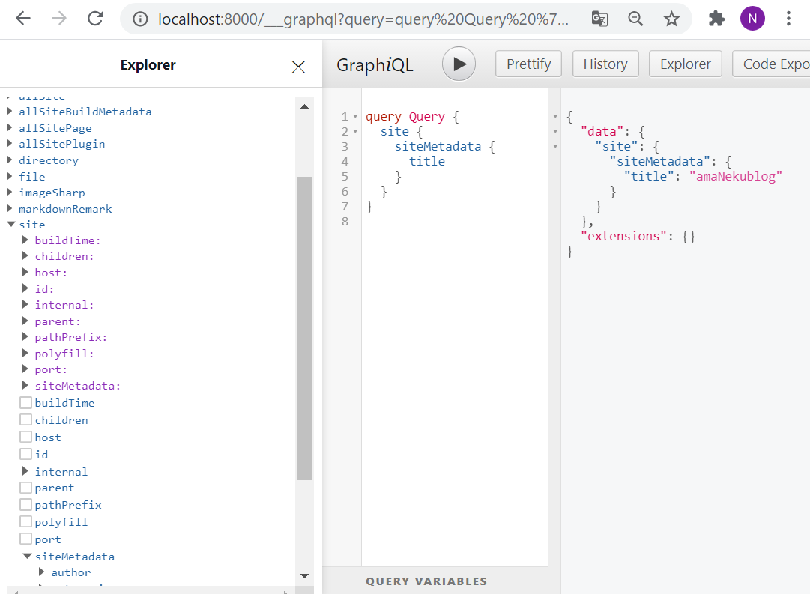
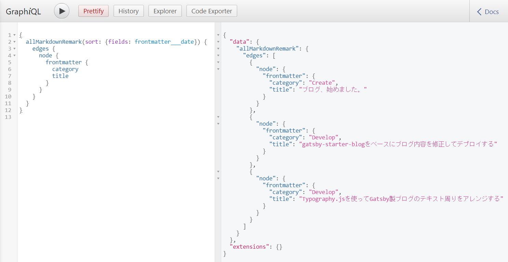

今回はカテゴリ別で記事一覧を表示するページを作っていきます。GatsbyJSの公式サイトに手順が載っていたため、これを参考に進めます。

＜参考＞  
[https://www.gatsbyjs.com/docs/adding-tags-and-categories-to-blog-posts/](https://www.gatsbyjs.com/docs/adding-tags-and-categories-to-blog-posts/)

## 1. 手順の把握

---

参考サイトから不要な手順を除くと、必要な手順は以下の４つです。

1. markdownファイルのfrontmatterに「カテゴリ」を追加する
2. クエリを記述して、投稿のすべてのカテゴリを取得する
3. カテゴリページテンプレートを作成する（/{category}に）
4. そのテンプレートを使用してページをレンダリングするようにgatsby-node.jsを変更する

今回は手順2. までを解説します。

## 2. 実装

---

### 2-1. markdownファイルのfrontmatterに「カテゴリ」を追加する

「frontmatter」はmarkdownファイルの先頭の「—-」で囲まれているものです。ここにはタイトルや投稿日といった記事のメタデータを記述します。ここに記事の「カテゴリ」を追加します。

```jsx
---
title: ブログ、始めました。
date: "2020-09-04T00:00:00.000Z"
description: "今日からブログを始めます。"
category: "Create"                    //★追加
---
```

### 2-2. クエリを記述して、すべての記事のカテゴリを取得する

記事のカテゴリに応じて、その記事をカテゴリ別の記事一覧ページに列挙するかどうかを分別したいです。そのためには2-1. で追加した「カテゴリ」を何らかの手段で取得する必要があります。Gatsbyでは[GraphQL](https://graphql.org/)が利用可能です。

GraphQLはAPI向けに作られたクエリ言語です。例えば、以下のようなクエリでブログ内の情報（メタデータや記事の内容など）を取り出すことができます。※私もまだまだ詳しくないので、詳細は[GraphQLの公式サイト](https://graphql.org/)を参照して下さい。

```graphql
query Query {
  site {
    siteMetadata {
      title
    }
  }
}
```

自分のサイトでのGraphQLでのクエリ結果を確かめるために、**GraphiQL**が利用できます。`gatsby develop`で開発用サーバーを実行中に、`http://localhost:8000/___graphql` から利用できます。



一番左が探索できるデータになります。ここから目的のデータを選択すると、真ん中にそれを取得するためのクエリが勝手に出力されます。もちろん自分でクエリを記述することもできます。一番右がクエリの結果です。

さて、すべての記事のカテゴリを取得するためのクエリですが、以下で取得できます。

```graphql
{
  allMarkdownRemark(sort: {fields: frontmatter___date}) {
    edges {
      node {
        frontmatter {
          category
          title
        }
      }
    }
  }
}
```

結果



全てのMarkdownファイルを日付順でソートし、そのカテゴリとタイトルが取得できました。

本日はここまでです。次回、続きを解説します。
