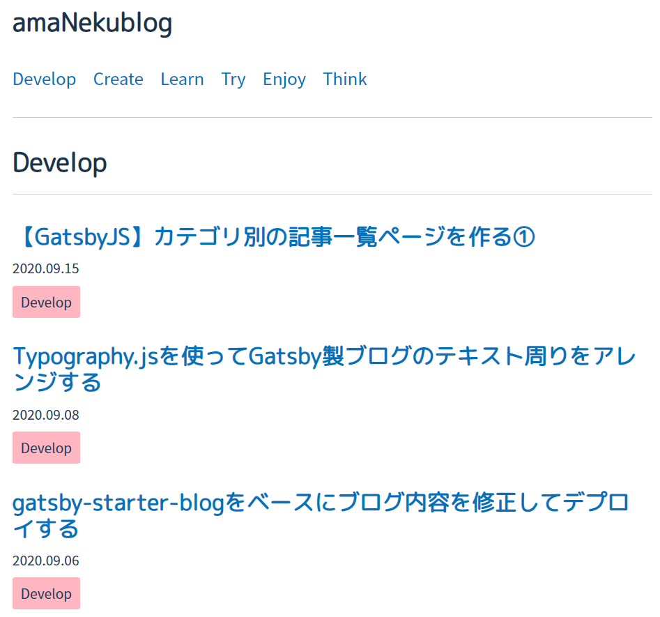

前回に引き続き、GatsbyJSを使ったカテゴリ別記事一覧ページの作成について解説します。

今回は以下の手順の3,4を解説します。

1. markdownファイルのfrontmatterに「カテゴリ」を追加する
2. クエリを記述して、投稿のすべてのカテゴリを取得する
3. カテゴリページテンプレートを作成する（/{category}に）
4. そのテンプレートを使用してページをレンダリングするようにgatsby-node.jsを変更する

## 1. 実装

---

### 1-1. カテゴリページテンプレートを作成する（/{category}に）

カテゴリのページは複数作成したいです。一つずつ作成することもできますが、それだと効率が悪い（カテゴリのページを修正したい場合、複数個同じ修正が必要）ですよね。そこで、カテゴリページ用のテンプレートを作成します。

ページのテンプレートは `/src/templates` に配置します。すでにブログ記事ページ用のテンプレートファイル `blog-post.js` が置いてありますね。ここに `category.js` という名前でテンプレートファイルを新規作成します。

ファイルの内容ですが、カテゴリページはホームページ（記事一覧ページ）と同じレイアウトにしたいので、`/src/pages/index.js` を流用することにしました。結果、以下のようになりました。

```jsx
import React from "react"
import { Link, graphql } from "gatsby"

import Layout from "../components/layout"
import SEO from "../components/seo"
import Postcategory from "../components/postcategory"
import { rhythm } from "../utils/typography"

const CategoryTemplate = ({ data, pageContext, location }) => {
  const siteTitle = data.site.siteMetadata.title
  const posts = data.allMarkdownRemark.edges
  const { category } = pageContext

  return (
    <Layout location={location} title={siteTitle}>
      <SEO title={`${category} | amaNekublog`} />
      <h2>{category}</h2>
      <hr
        style={{
          marginBottom: rhythm(1),
        }}
      />
      {posts.map(({ node }) => {
        const title = node.frontmatter.title || node.fields.slug
        return (
          <article key={node.fields.slug}>
            <header>
              <h3
                style={{
                  marginBottom: rhythm(1 / 4),
                }}
              >
                <Link style={{ boxShadow: `none` }} to={node.fields.slug}>
                  {title}
                </Link>
              </h3>
              <small
                style={{
                  display: `block`,
                  marginBottom: rhythm(1 / 4),
                }}
              >
                {node.frontmatter.date}
              </small>
            </header>
            <p>
              <Postcategory postcategory={node.frontmatter.category}/>
            </p>
          </article>
        )
      })}
    </Layout>
  )
}

export default CategoryTemplate

export const pageQuery = graphql`
  query($category: String) {
    site {
      siteMetadata {
        title
      }
    }
    allMarkdownRemark(
      sort: { fields: [frontmatter___date], order: DESC }
      filter: { frontmatter: { category: { in: [$category] } } }
    ) {
      edges {
        node {
          excerpt
          fields {
            slug
          }
          frontmatter {
            date(formatString: "YYYY.MM.DD")
            title
            description
            category
          }
        }
      }
    }
  }
`
```

以下、詳細解説

```jsx
const CategoryTemplate = ({ data, pageContext, location }) => {
  ...
}

export default CategoryTemplate
```

Gatsbyにページレンダリングをしてもらいたいページの基を「`CategoryTemplate`」として定義し、それをデフォルトエクスポートします。関数の引数に渡されるものは次の通り。

- `data`：このソース内のGraphQLクエリの結果
- `pageContext`：コンテキスト情報。任意に設定でき、ここではカテゴリ名が渡されるようにしています。
- `lacation`：ページのパス

```graphql
export const pageQuery = graphql`
  query($category: String) {
    site {
      siteMetadata {
        title
      }
    }
    allMarkdownRemark(
      sort: { fields: [frontmatter___date], order: DESC }
      filter: { frontmatter: { category: { in: [$category] } } }
    ) {
      edges {
        node {
          excerpt
          fields {
            slug
          }
          frontmatter {
            date(formatString: "YYYY.MM.DD")
            title
            description
            category
          }
        }
      }
    }
  }
`
```

前回解説したGraphQLです。ここでは変数名を `pageQuery` としていますが、決まりはないそうです。この結果が `CategoryTemplate` の引数 `data` に渡されます。また、コンテキスト情報はこのクエリのパラメータ(`$category: String`)としても利用でき、特定のカテゴリだけがフィルターにかかるようにしています。

### 1-2. そのテンプレートを使用してページをレンダリングするようにgatsby-node.jsを変更する

ページを動的にレンダリングする場合は、GatsbyのNode APIの一つ「`CreatePages`」を利用します。

Node APIを利用するには、プロジェクトのルート直下にある`gatsby-node.js`にて実装し、それをエクスポートします。gatsby-starter-blogでは、すでに記事ページ作成用に`CreatePages`を実装していましたので、これを少し修正するだけでOKです。

```jsx
exports.createPages = async ({ graphql, actions }) => {
  const { createPage } = actions

  const blogPostTemplate = path.resolve(`./src/templates/blog-post.js`)
  const categoryTemplate = path.resolve(`./src/templates/category.js`)
  const result = await graphql(
    `
      {
        allMarkdownRemark(
          sort: { fields: [frontmatter___date], order: DESC }
          limit: 1000
        ) {
          edges {
            node {
              fields {
                slug
              }
              frontmatter {
                title
              }
            }
          }
        }
        site {
          siteMetadata {
            categories {
              name
            }
          }
        }
      }
    `
  )

  if (result.errors) {
    throw result.errors
  }

  // Create blog posts pages.
  // ※省略

  // Create category pages.
  const categories = result.data.site.siteMetadata.categories

  categories.forEach(category => {
    createPage({
      path: `/${category.name}/`,
      component: categoryTemplate,
      context: {
        category: category.name,
      },
    })
  })

}
```

以下、詳細解説

```jsx
const categoryTemplate = path.resolve(`./src/templates/category.js`)
```

1-1. で作成したテンプレートのソースコードを読み込んでいます。

```jsx
const result = await graphql(
  `
    {
      allMarkdownRemark(
        //省略
      site {
        siteMetadata {
          categories {
            name
          }
        }
      }
    }
  `
)
```

GraphQLです。`allMarkdownRemark` の箇所は記事ページで必要なクエリなので、省略します。`site` の箇所では、あらかじめメタデータとして`gatsby-config.js`に登録しておいた、本ブログの全カテゴリの名前を取得しています。

```jsx
const categories = result.data.site.siteMetadata.categories

categories.forEach(category => {
  createPage({
    path: `/${category.name}/`,
    component: categoryTemplate,
    context: {
      category: category.name,
    },
  })
})
```

各カテゴリごとに `CreatePage` を呼び出しています。`CreatePage` は、`CreatePages` で引数として渡している `actions` に含まれる関数の一つ（`const { createPage } = actions` で読み込み済み）です。`CreatePage` はその名の通りページを作成するための関数です。渡す引数は次の通り。

- `path`：作成するページのパス。単純にカテゴリ名にします。
- `component`：読み込み済みのテンプレートのソースコードへのパス。
- `context`：ページコンテキスト。テンプレート側で使います。

## 2. 完成

カテゴリ別の記事一覧ページができました！



以上です。今回の改修で何となくGatsbyJSのことや、JavaScriptのことがわかってきたので、良い挑戦ができたなと感じています。が、、まだまだブログとしてはいけてないので、少しずつ改善していけたらと思います。今後はブログをカスタマイズしたときに気まぐれに更新していこうと思います。
